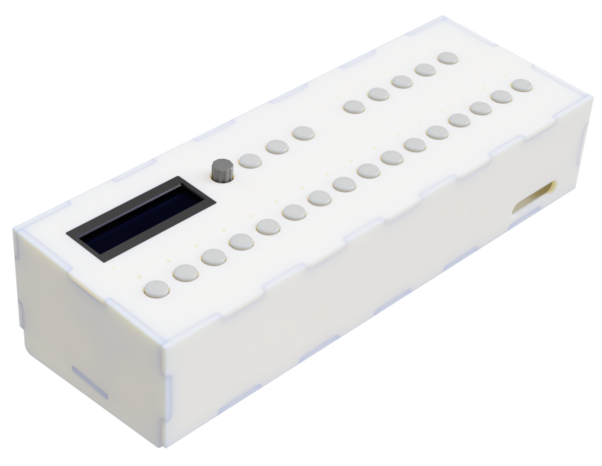
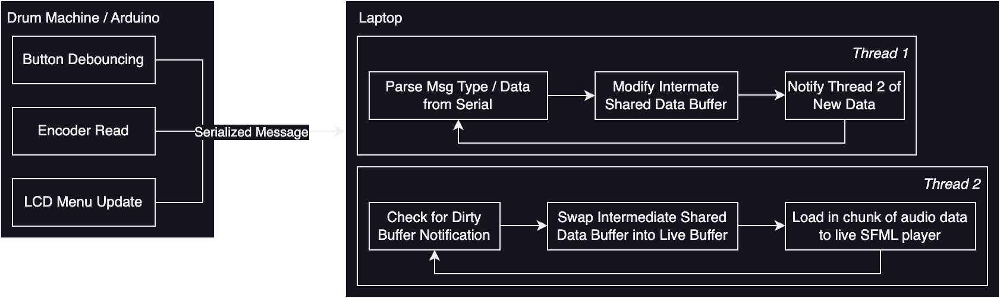

# Arduino Drum Machine (DM-095)

An Arduino drum machine inspired by models like the Roland TR-808 and Teenage Engineering KO2.

## Demo

For a brief demo of me using the drum machine to create a simple looping drum beat, see this [YouTube video](https://youtu.be/vI9WxUwxQTk).

## Introduction / Architecture

This repository contains code for a drum machine made with an Arduino Uno input device and realtime audio mixing, synchronization, and playback written in C++ intended to be run on OSX. 

Below find a block diagram outlining the process for playing back the looping drum beats. The Uno is responsible for handling the I/O of the device, including beat buttons, track selection, sample selection, pause/play, track mute/unmute, and menu selection via rotary encoder and LCD. When relevant I/O happens which changes the structure or sound of the drum loop, the Uno sends a serialized message to the playback device (in this case, my MacBook Pro running the audio mixer).

The playback device consists of two threads:
- The first thread listens for incoming serial messages and creates the drum loop from audio samples. The serial listener reads incoming serial messages and uses a single-producer/single-consumer queue to add actions onto a shared queue between both threads. When the drum loop audio buffer needs to be modified, an intermediate buffer stores the updated track info an a dirty bit is set.
- On the playback thread, the audio buffer is chunked into N samples and fed to SFML with a callback function every N samples. Inside the callback, if the dirty bit has been set by the other thread, the callback thread swaps the intermediate butter into the live buffer and continues as normal. 

This process repeats, handling beat triggering (turn a particular 16th note on or off on the current track), mute/unmute a track, sample the wav for a particular instrument, pause/play the entire beat, change BPM, and reset the loop. The machine supports 1 bars worth of music at BPMs from 30 to 255 and up to 5 simultaneous tracks.

## Setup

The instrument wav files are included in `instruments.zip`. Unzip this to load the instrument sound files. 

Lookup tables are auto-generated with a python file in the `src/instrument_lut_gen.py` to create header files with static filepaths for the drum machine's display to use. 

Compile the OSX-side synthesizer with `make clean && make mac` and load the Arduino code onto the Uno once everything is plugged in. Circuit diagrams and assembly WIP.
